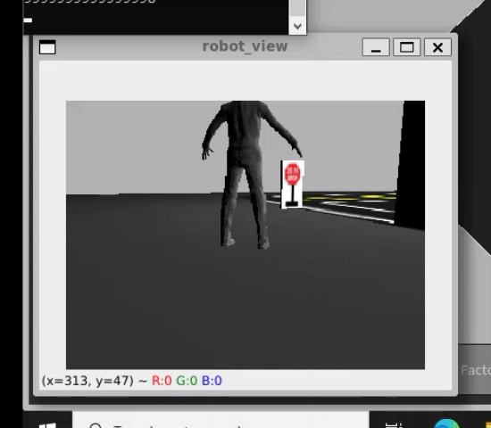

# Turtlebot3 Object Tracker

This package attempts to implement a simple object tracking robot. We make use of turtlebot3's crappy laggy camera sensor to receive robot's view, the YOLO object detection/classification module to find the target and a plain controller to follow our target.

## Requirements
- [ROS Noetic](http://wiki.ros.org/noetic)
- [turtlebot3](https://github.com/ROBOTIS-GIT/turtlebot3), [turtlebot3_msgs](https://github.com/ROBOTIS-GIT/turtlebot3_msgs) and [turtlebot3_simulations](https://github.com/ROBOTIS-GIT/turtlebot3_simulations)
- [numpy](https://numpy.org/)
- [ultralytics](https://docs.ultralytics.com/)
- [opencv-python](https://pypi.org/project/opencv-python/)

## Target
You control the target using keyboard. Note that the target itself (that weird stiff faceless bipedal Slender Man) is a **turtlebot3_burger** and you can control it via the **turtlebot3_teleop** package.

## Components
1. ### The Image Processor Node
This node is responsible for receiving robot's camera view, perform detections and return the requested target's position in the image along with the image resolution.
This node must create a YOLO model to do the task of object detection/classification. Feel free to setup your model based on any of the pretrained weights provided in the "yolo" directory or any custom one of your own.
You need to complete this section.

2. ### The Controller Node
This node must implement a simple P-controller (you can set up a full PID-controller, but you're likely to regret it, don't play hero). Using the data provided by the image processor's service, this node must guide the robot to its target.
You need to complete this section.

## How do I build this?
1. Install the requirements.
2. Clone this package beside your `turtlebot3` packages.
3. Navigate to the root directory of your `catkin` workspace.
4. Do `catkin_make`.

## How do I run this?
1. Navigate to the root directory of your `catkin` workspace.
2. Source your workspace: ```. devel/setup.bash```.
3. Launch the provided launch file: ```roslaunch turtlebot3_object_tracker turtlebot3_object_tracker.launch```.

## Note
Feel free to test your system in any of the world files provided by **turtlebot3_simulation**, the one provided in this package or any custom world file you feel cosy in.

## Expected Output
The robot must be able to detect the target when viewed and start following it. When the target is not in sight, you can assign any desired behaviour to your robot.


